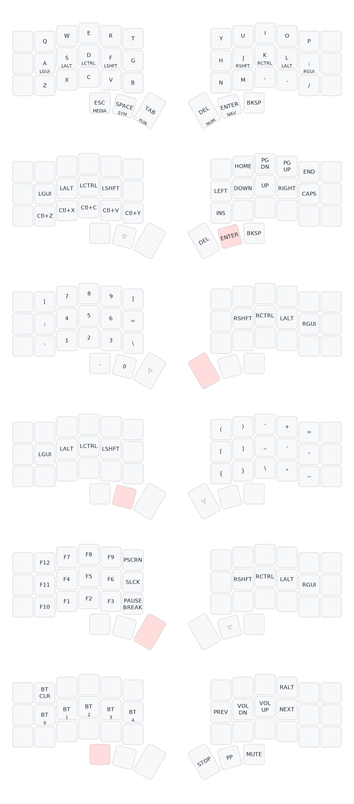

# Corne ZMK Config

Personal ZMK configuration for my Corne keyboard. Forked from [t18n/zmk-config-corne](https://github.com/t18n/zmk-config-corne).

## Layout

Based on [Miryoku](https://github.com/manna-harbour/miryoku) with the following modifications:

- **QWERTY** base layer instead of Colemak-DH
- **Vim-style navigation** (hjkl = left/down/up/right) on NAV layer
- **Programmer-friendly symbols** on right side of SYM layer
- **Thumb rows**: Esc/MEDIA, Space/SYM, Tab/FUN | Del/NUM, Enter/NAV, Bksp
- **LALT on both sides** (no AltGr on base layer to avoid accented characters)
